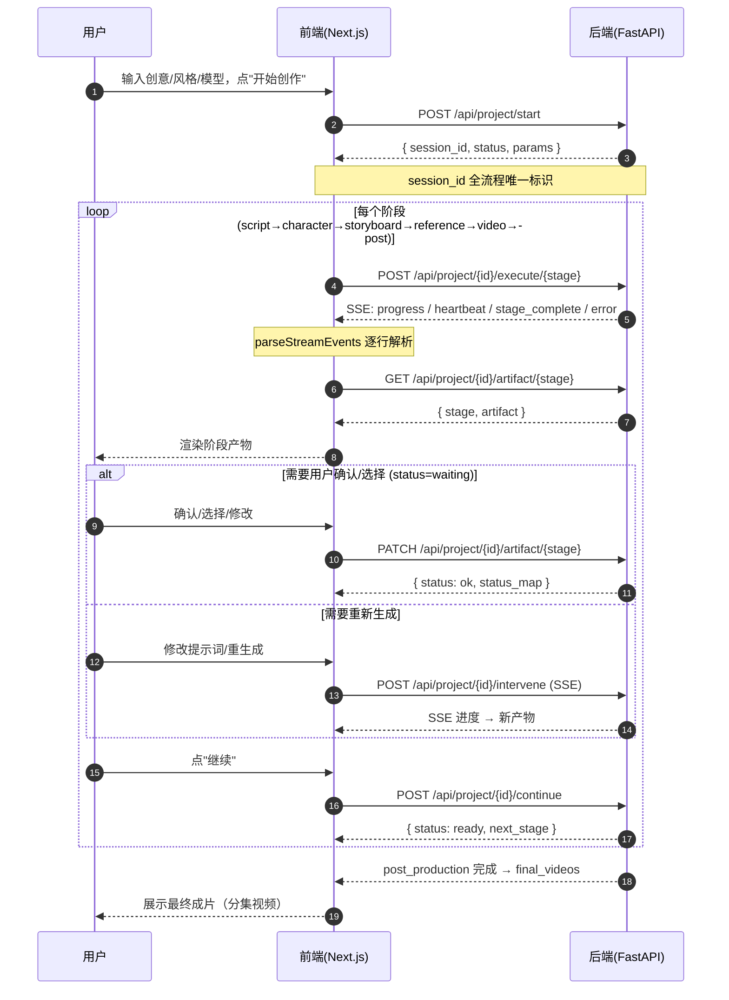
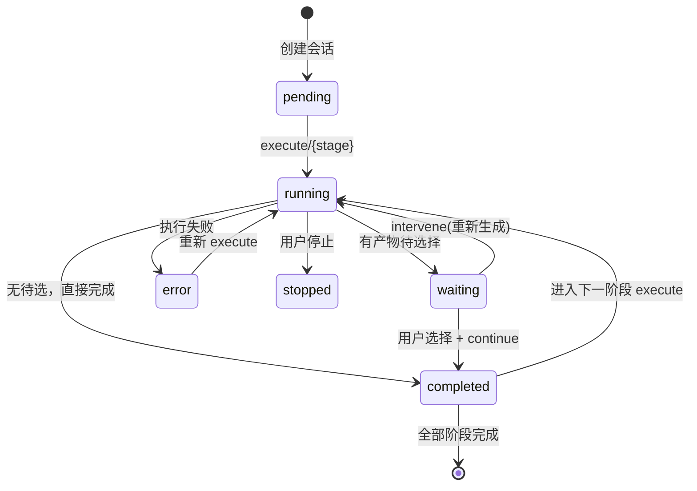
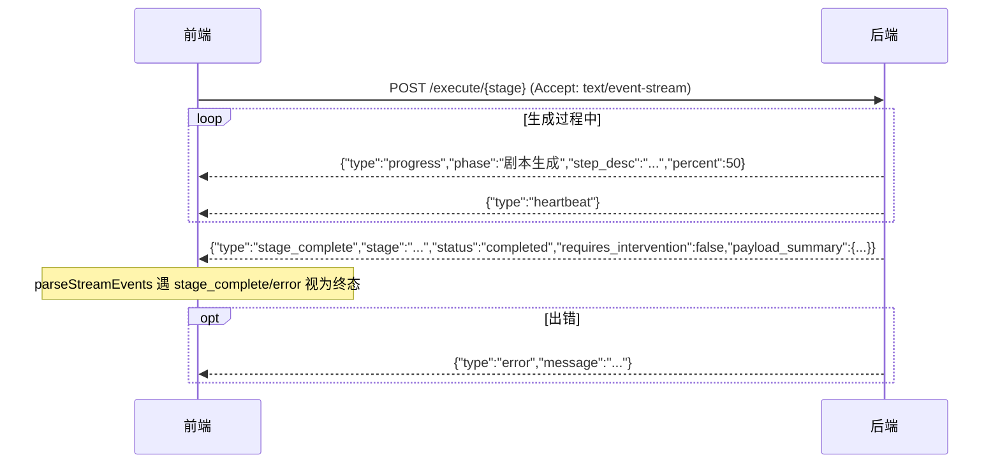

# 07 · 主流程交互时序图

> 本文用时序图 + 状态机图描述主流程（6 阶段工作流）前后端交互，供重写前端时对齐节奏。

## 1. 完整流程时序（含停点）



## 2. 阶段状态机



状态值：`pending` / `running` / `waiting` / `completed` / `stopped` / `error`。
`GET /api/project/{id}/status` 返回**每个阶段**一个状态（`status` 是映射，非单一值）。

## 3. SSE 事件时序（execute/intervene）



前端注意：`execute`/`intervene`/`tasks/{id}/events` 必须直连 `NEXT_PUBLIC_API_URL`（默认 `http://127.0.0.1:8000`），不能走 Next 代理。

## 4. 修改 / 续写 / 重生成流程

```mermaid
flowchart TD
    A[阶段产物已展示] --> B{用户意图}
    B -->|改提示词/描述| C[PATCH /artifact/{stage}]
    B -->|重新生成某些项| D[POST /intervene<br/>modifications: regenerate_xxx]
    B -->|剧情续写| E[POST /execute/script_generation<br/>带续写参数]
    C --> F[GET /status 确认状态流转]
    D --> G[SSE 进度 → 新版本写入 versions]
    E --> H[续写预览状态 waiting<br/>产物含 new_episodes]
    F --> I[POST /continue 进下一阶段]
    G --> I
    H --> I
```

### 重生成关键字段

| 阶段 | modifications 键 | 值 |
|---|---|---|
| character_design | `regenerate_characters` / `regenerate_settings` | id 数组 |
| reference_generation | `regenerate_scenes` | segment_id 数组 |
| video_generation | `regenerate_clips` | segment_id 数组 |

后端会**合并**重生成结果（保留 `selected` 与旧 `versions`，追加新版本），不会覆盖用户已选内容。

## 5. 停点清单（Agent/前端对齐）

| 停点 | 阶段 | 产物确认内容 |
|---|---|---|
| 0 | 创建项目前 | 创意、集数、风格、比例 |
| 1 | 创建项目前 | 模型与参数配置 |
| 2 | script_generation | 全集剧本 |
| 3 | character_design | 角色/场景图选择 |
| 4 | storyboard | 分镜列表 |
| 5 | reference_generation | 参考图选择 |
| 6 | video_generation | 视频片段选择 |
| 7 | post_production | 成片（无需确认，直接交付） |
